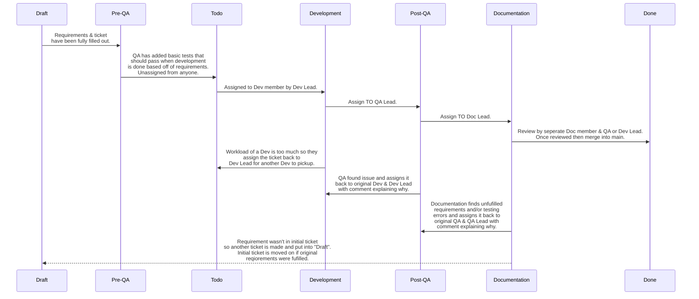

## 2025 SVSU Capstone

Welcome to organization for managing the 2025 SVSU Capstone project. The project is called PLOT and is being used as a way to layout floor plans and allocate shelf spacing for our client who is a retail store.

### Table of Contents
- [🚀 Quickstart](#-quickstart)
  - [🐋 Install Docker](#-install-docker)
  - [🔑 Add an SSH Key ](#-add-an-ssh-key )
  - [📥 Pull Repository](#-pull-repository)
  - [📚 Pull Sub-repositories](#-pull-sub-repositories)
  - [🧩 Environment Variables](#-environment-variables)
    - [🪟 Extras for Windows](#-extras-for-windows)
  - [🧪 Checking your Development Environment](#-checking-your-development-environment)
  - [🌳 Branches](#-branches)
  - [🏁 Finish Developing](#-finish-developing)
  - [👾 Using Git in VSCode](#-using-git-in-vscode)
  - [✍️ Committing Changes](#-committing-changes)
  - [♻️ Branch Switching](#-branch-switching)

---

### 🎟️ Ticket Workflow


> Solid arrows mean that a ticket is moved from one state to another. Dotted arrow signifies that an action happens but that the ticket itself didn't move to that state.

### 🔍 Overview
...

---

### 🚀 Quickstart
##### 🐋 Install Docker
Go to the ["Get Started" Docker page](https://www.docker.com/get-started/), click “Download Docker Desktop”, click the button for your operating system and follow the instructions.
_(You can skip account setup, but I personally did not. I set it up with my Google account.)_

##### 🔑 Add an SSH Key 
Go to the ["Generating a New SSH Key and Adding it to the SSH Agent" documentation](https://docs.github.com/en/authentication/connecting-to-github-with-ssh/generating-a-new-ssh-key-and-adding-it-to-the-ssh-agent) and follow the instructions for generating a new SSH key for your operating system.
Make sure to use the email associated with your GitHub account that you joined the organization with.
_(When you see the prompts for entering a file and a passphrase, do not type anything, just press enter.)_

Following the ["Testing Your SSH Connection" documentation](https://docs.github.com/en/authentication/connecting-to-github-with-ssh/testing-your-ssh-connection), open the command line. Test your SSH key by using the command:  `ssh -T git@github.com`. You should see a message saying:

```
Hi [your GitHub username]! You've successfully authenticated, but GitHub does not provide shell access.
```
_(Don’t worry about the shell access, you don’t need it.)_

Go into the folder where that SSH key has been saved (it is the path that was shown in the “Enter file in which to save the key” prompt). You should see a `.pub` file with the default key name. Right click it and open it as a text file. Copy the contents of that file to your clipboard.

Following the ["Adding a New SSH Key to your GitHub Account" documentation](https://docs.github.com/en/authentication/connecting-to-github-with-ssh/adding-a-new-ssh-key-to-your-github-account), go to your account settings on GitHub and find “SSH and GPG keys” in the sidebar under “Access”. Add a new key and paste the contents of that .pub into the key section. You can title the key whatever, I personally just called it PLOT.

##### 📥 Pull Repository
Open the command line if you do not already have it open and `cd` into the folder you want the project to be stored in.

Run the following command: 
```
git clone git@github.com:SVSU-Capstone25/PLOT.git
``` 

The output should end with `Resolving deltas: 100% (4/4), done` if the process has gone correctly.

##### 📚 Pull Sub-repositories
Open the folder where you just pulled the repository down in VS Code.
Open a new terminal in VS Code and run the following command: `git submodule update --init --recursive` .

##### 🧩 Environment Variables
In the root folder of the project, make a file called `.env` .
Copy the contents of `.default.env` into `.env` .
Change `MSSQL_SA_PASSWORD=password` to `MSSQL_SA_PASSWORD=yourStrong(!)Password` .

###### 🪟 Extras for Windows
In the folder labeled PLOT-DB, go into `entrypoint.sh` and `init.sh` and make sure it says LF, not CRLF, in the bottom right.

##### 🧪 Checking your Development Environment
Go to debug tools on left and hit the play button. The first time will take a moment because the Docker container is building.
If it is fully working, in Docker desktop you’ll be able to navigate to “Containers” on the left, click into the one labeled “plot” and see all three containers needed for development running. If any of them are orange or gray in Docker desktop instead of green, ensure you did the previous steps correctly or contact your group lead.

To ensure that your project is working, visit these two test links.

[http://localhost:8085/weatherforecast](http://localhost:8085/weatherforecast)
Should show a JSON response of weather data.

[http://localhost:8080](http://localhost:8080)
Should show the default page for a Blazor project.

##### 🌳 Branches
When you first get set up, all the sub-repos will have their identifiers as the selected branch instead of the main branch. Click on the identifier and create a new branch from main before developing. There is more on switching branches below.

When creating a new branch, name it after the thing you are doing (for example, I made a branch called “StoreDashboard”).

##### 🏁 Finish Developing
When you finish developing, make sure to press the stop square on the VSCode debugger (top of your screen) to trigger the Docker clean up script. 
**⚠️ DO NOT CTRL+C ⚠️**

##### 👾 Using Git in VSCode
In VS Code, click the icon with branches on the left to go to the source control panel. You can see the three separate sub-repositories as well as the main repository. 
**Keep work to your sub-repository (front-end, back-end, or database).**

##### ✍️ Committing Changes
When you want to commit a change, you can see all your changed files here. If you hover over them, you will see a plus button. Press this button to “stage” your changes. Then, you can enter your commit message in the textbox before finally pushing “commit”. Once you press commit, the button will change to say sync changes. Be sure to press that as well. If you ever need to, you can click the circular arrow next to the three dots to refresh a branch and make sure you are up to date with the latest changes.

##### ♻️ Branch Switching
To quickly switch/checkout branches in VS code, you can click on the branch name next to the sub-repository you are working in to switch.

This isn’t the only way to switch/checkout branches. If you click the three dots by a sub-repository, you can see all your Git commands that you’ve used before.

---

#### Frontend
...

---

#### Backend
...

---

#### Database
...

---

#### Workflows

##### QA

Once Development has finished their work, the ticket should be moved to the "QA" column on the project board and will not be assigned to anyone initially. The QA lead will then dish out the tickets based on the load of each QA member. Once a QA member gets a ticket they will then switch to the branch via the "Source Control" on the left bar in VSCode and make sure all their branches are synced/up-to-date. The QA member will then check to make sure the requirements were fufilled and then write the proper tests, based on what repository it's in. Requirements are considered not fufilled if the feature provided by dev is missing key functionality and design. If this is the case, QA will leave issues on the pull request via the "Files Changed" tab.


You can leave comments on specific lines of code by clicking and dragging the blue plus button and then leaving a comment in the comment box that appears:


When leaving a comment make sure to @ the original dev and leave a thorough comment on what needs to be changed and why. If the dev feels like it doesn't need to be changed and they present a good argument via replying to the issue then the QA memeber can resolve the issue.

Once you leave all your comments on the pull request make sure to click the "Review Changes" button and select the "Request Changes" radio button. If the request you're making cannot be tied to a specific line of code you can always leave the full request change in the comment box within the "Review Changes" pop-up box.


Once you click "Submit Review", you should then assign the pull request to the original dev within the "Asignees" section, and also yourself if you're not already assigned. Once they're assigned, you can navigate back to the original ticket for the feature through the link in the "Development" section.


Once you're back in the ticket, you should unassign yourself and reassign the original dev via the "Assignees" section, there should only ever be one person assigned to a ticket to make sure we know who's hands it is in now. You also need to change the status via the "Projects" section back to "Development".


Finally, make sure to grab a link to the **pull request** that your issues are commented on and @ the dev member in the Discord to give them a heads up that the ball is in their court.

When the ticket comes back to you after the issues have been resolved, make sure to go through the pull request and press the "Resolve Issue" button **if** the issue has been resolved properly. If it hasn't then reach out to the dev and ask why it wasn't fufilled and if anything the pull request and ticket might need to be moved back to them. If everything is resolved though, go into your VSCode and make sure to sync and pull the most up-to-date version of the branch via the "Source Control" on the left bar in VSCode. You can then go ahead and write your tests if you haven't written any yet or write extra ones if changes have been made and extra ones are needed.

If things become more complicated via some string of events you can always reach out to the QA lead for help.

---

### Links
...
